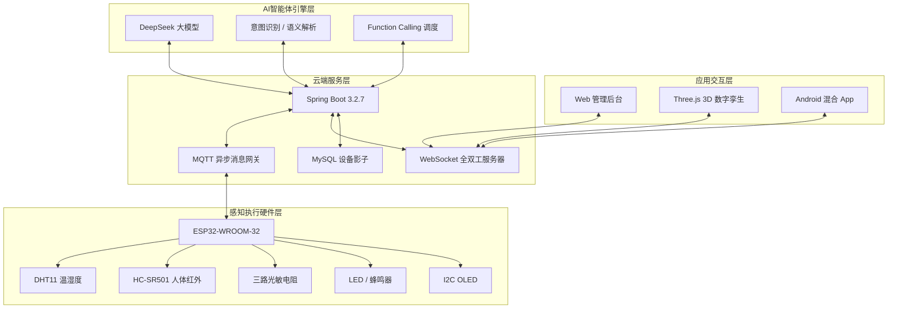

# AIoT 无线传感网智能体系统

> 基于 ESP32 的智能家居系统


本项目面向室内无线传感与智能控制场景，设计并实现了一套以 **ESP32 无线传感终端** 为感知执行底座、以 **MQTT + WebSocket** 为通信骨架、以 **DeepSeek 大模型智能体** 为决策大脑、以 **移动 App / ECharts 大屏 / Three.js 3D 数字孪生** 为交互入口的 AIoT 全链路系统。

系统核心思想是：**快控优先、模型兜底**。高频、标准指令走本地/规则快控通道，低延迟、低 Token 成本；模糊、长尾、多设备联动语义交给云端大模型推理，实现自然语言控制与工具调用。

---

## 目录

- [功能亮点](#功能亮点)
- [系统架构](#系统架构)
- [技术栈](#技术栈)
- [硬件清单与接线](#硬件清单与接线)
- [通信协议](#通信协议)
- [数据库设计](#数据库设计)
- [快速开始](#快速开始)
- [配置示例](#配置示例)
- [功能验证](#功能验证)
- [License](#license)

---

## 功能亮点

- **全链路技术闭环**：ESP32 采集 → MQTT 上报 → Spring Boot 云端治理 → DeepSeek 语义推理 → MQTT 控制下发 → 硬件执行 → 设备影子回置 → WebSocket 推送 → App / 大屏 / 3D 数字孪生实时联动。
- **多模态自然语言交互**：支持文本、语音控制，模糊意图可被大模型解析为标准化 IoT 控制 JSON。
- **快控优先、模型兜底**：
  - “打开灯”“关闭灯”“亮屏”“息屏”等高频指令走本地规则匹配，零时延、低 Token。
  - “屋里太暗了”“准备睡觉”“有人进来提示我”等模糊语义走 DeepSeek 大模型推理。
- **设备影子模型**：云端为每个物理终端建立虚拟镜像，控制端与展示端只与影子交互，支持离线状态感知与状态回置闭环。
- **通信自愈机制**：WiFi STA 非阻塞重连 + MQTT 断线重连状态机 + 遗嘱消息 + QoS1，提升弱网稳定性。
- **3D 高保真数字孪生**：基于 Three.js + WebGL 构建“2 室 1 厅 1 卫”户型，灯光、人体红外安防脉冲与物理硬件毫秒级联动。
- **移动混合 App**：AI 对话首页 + 卡片式设备控制页 + 语音采集 / ASR / TTS 全链路闭环。
- **ECharts 运行态势大屏**：设备在线统计、消息吞吐趋势、事件类型分布，5 秒周期动态刷新。

---

## 系统架构

系统采用四层拓扑架构：感知执行硬件层、网络通信与云端服务层、AI 智能体引擎层、应用交互层。



### 1. 感知执行硬件层

- 主控：ESP32-WROOM-32 双核 240MHz MCU
- 传感器：DHT11 温湿度、HC-SR501 人体红外、三路光敏电阻
- 执行器：LED 阵列、有源蜂鸣器、I2C OLED 显示屏
- 本地快控：暗光自动开灯、强光自动关灯、人体闯入蜂鸣报警

### 2. 网络通信与云端服务层

- WiFi STA 模式组网
- MQTT 异步消息网关，QoS1
- Spring Boot 3.2.7 后端
- MySQL + MyBatis 持久化
- WebSocket 全双工长连接
- 设备影子模型

### 3. AI 智能体引擎层

- DeepSeek-V3 / R1 大模型底座
- OpenAI 兼容接口
- Prompt 工程与上下文管理
- Function Calling 工具调用
- 外部 API：天气、地图路径规划

### 4. 应用交互层

- Web 标准管理后台
- ECharts 运行态势大屏
- Three.js 3D 数字孪生大屏
- Android 混合开发中控 App

---

## 技术栈

| 分层 | 核心组件 / 框架 | 版本 / 协议 | 选型说明 |
|---|---|---|---|
| 感知执行硬件层 | ESP32-WROOM-32 | 双核 240MHz | 提供边缘计算与 WiFi 通信能力 |
| 固件开发 | Arduino / PlatformIO | PlatformIO | 声明式依赖管理，规范化固件迭代 |
| 通信协议 | MQTT | QoS1 | 降低移动网络功耗与丢包率 |
| 实时推送 | WebSocket | 全双工 | 数字孪生与 App 状态毫秒级同步 |
| 云端服务 | Spring Boot | 3.2.7 | 高并发接收传感报文 |
| 数据库 | MySQL + MyBatis | MySQL 8 / MyBatis | 设备影子与历史遥测治理 |
| AI 智能体 | DeepSeek | V3 / R1 | 高性价比长尾语义推理 |
| 语义接口 | OpenAI 兼容协议 | Function Calling | 多设备与外部 API 工具编排 |
| 3D 数字孪生 | Three.js + WebGL | 原生 ESM | 高保真 3D 渲染与轻量化加载 |
| 前端构建 | Vite 5 + ESM | Vite | 提升 3D 渲染管线开发效率 |
| 可视化 | ECharts | 5.x | 态势大屏图表 |
| 移动端 | Android 混合 App | Android 11+ | AI 对话、语音、卡片控制 |

---

## 硬件清单与接线

| 外设组件 | 接口类型 | ESP32 GPIO | 信号方向 | 说明 |
|---|---|---|---|---|
| DHT11 温湿度传感器 | 单总线 1-Wire | GPIO 23 | 输入 | 定时触发采样，读取 40-bit 温湿度数据 |
| HC-SR501 人体红外 | 数字电平 | GPIO 13 | 输入 | 有人输出 3.3V 高电平，无人 0V |
| 三路光敏电阻 | 模拟电压 / ADC | ADC1_CH6 / GPIO 34 | 输入 | 12 位 ADC，范围 0~4095 |
| I2C OLED | I2C | 按工程配置 | 输出 | 地址 0x3C，400kHz，显示 IP、模式、状态 |
| LED 状态灯 | GPIO | GPIO 18 | 输出 | 本地快控 / 远程控制 |
| 有源蜂鸣器 | GPIO | GPIO 19 | 输出 | 人体闯入安防报警 |

> 实际接线请以 `firmware/` 工程中的引脚定义和硬件实物为准。

---

## 通信协议

### MQTT 主题

| 方向 | 主题 | 说明 |
|---|---|---|
| 上行遥测 | `aiot/device/telemetry/<Device_UUID>` | ESP32 周期上报传感与状态 JSON |
| 下行控制 | `aiot/device/control/<Device_UUID>` | 云端下发控制 JSON |
| 遗嘱消息 | `aiot/device/status/<Device_UUID>` | 设备异常离线通知，示例主题 |

### 遥测报文示例

```json
{
  "deviceId": "ESP32_Aiot_001",
  "ip": "192.168.1.100",
  "wifiRssi": -65,
  "temperature": 26.5,
  "humidity": 55.2,
  "lux": 620,
  "humanDetected": true,
  "ledStatus": false,
  "screenStatus": true,
  "mode": "AUTO"
}
```

### 控制报文示例

```json
{
  "ledStatus": true,
  "mode": "MANUAL"
}
```

### 本地快控逻辑

- 光敏快控：`lux < 500` 自动开灯；`lux >= 800` 自动关灯。
- 安全快控：`humanDetected == true` 且安防使能时，蜂鸣器报警。
- 自动模式：`mode = "AUTO"` 时，本地规则优先执行，不依赖云端大模型。

---

## 数据库设计

核心表：

- `aiot_device`：无线传感终端主表，记录设备编码、类型、IP、管理地址、在线状态、创建/更新时间等。
- `aiot_device_shadow`：设备影子实时状态表，记录 LED、屏幕、模式、光敏、人体红外、温湿度、WiFi RSSI 等。

```sql
CREATE TABLE `aiot_device` (
  `id` BIGINT AUTO_INCREMENT PRIMARY KEY,
  `device_code` VARCHAR(64) NOT NULL UNIQUE,
  `device_type` VARCHAR(32) DEFAULT 'ESP32_SENSOR',
  `ip_address` VARCHAR(45) DEFAULT NULL,
  `management_address` VARCHAR(255) DEFAULT NULL,
  `status` TINYINT DEFAULT 0 COMMENT '0离线 1在线',
  `create_time` DATETIME DEFAULT CURRENT_TIMESTAMP,
  `update_time` DATETIME DEFAULT CURRENT_TIMESTAMP ON UPDATE CURRENT_TIMESTAMP,
  `remark` TEXT DEFAULT NULL
) ENGINE=InnoDB DEFAULT CHARSET=utf8mb4;

CREATE TABLE `aiot_device_shadow` (
  `id` BIGINT AUTO_INCREMENT PRIMARY KEY,
  `device_code` VARCHAR(64) NOT NULL,
  `led_status` TINYINT DEFAULT 0,
  `screen_status` TINYINT DEFAULT 1,
  `current_mode` VARCHAR(10) DEFAULT 'AUTO',
  `lux_value` INT DEFAULT 0,
  `human_detected` TINYINT DEFAULT 0,
  `temperature` DECIMAL(5,2) DEFAULT NULL,
  `humidity` DECIMAL(5,2) DEFAULT NULL,
  `wifi_rssi` INT DEFAULT NULL,
  CONSTRAINT `fk_device_code` FOREIGN KEY (`device_code`) REFERENCES `aiot_device` (`device_code`) ON DELETE CASCADE
) ENGINE=InnoDB DEFAULT CHARSET=utf8mb4;
```

---

## 快速开始

### 环境要求

- ESP32-WROOM-32 开发板及外设
- PlatformIO / VS Code
- JDK 17+
- Maven 3.8+
- MySQL 8+
- MQTT Broker：Mosquitto / EMQX
- Node.js 18+
- Android Studio
- Chrome 120+

### 1. 克隆仓库

```bash
git clone https://github.com/your-org/aiot-esp32-smart-home.git
cd aiot-esp32-smart-home
```

### 2. 硬件端烧录

```bash
cd firmware
pio run -t upload
pio device monitor
```

在固件配置中修改：

- WiFi SSID / Password
- MQTT Broker 地址
- 设备 UUID / ClientID
- 控制主题与遥测主题

### 3. 启动后端

```bash
cd backend
mvn spring-boot:run
```

确保 MySQL、MQTT Broker 已启动，并修改 `application.yml` 中的连接信息与 DeepSeek API Key。

### 4. 启动 Web 前端

```bash
cd web
npm install
npm run dev
```

访问 Vite 输出的本地地址，即可查看管理后台、ECharts 大屏与 Three.js 数字孪生页面。

### 5. 构建 Android App

使用 Android Studio 打开 `mobile-app/`，配置局域网地址，构建并安装：

```bash
./gradlew assembleDebug
```

生成的 APK 可安装到 Android 11+ 真机。

---

## 配置示例

### `platformio.ini`

```ini
[env:esp32dev]
platform = espressif32
board = esp32dev
framework = arduino
monitor_speed = 115200

lib_deps =
  knolleary/PubSubClient
  adafruit/Adafruit SSD1306
  adafruit/DHT sensor library
```

### `application.yml`

```yaml
spring:
  datasource:
    url: jdbc:mysql://localhost:3306/aiot?useUnicode=true&characterEncoding=utf8
    username: root
    password: your_password
    driver-class-name: com.mysql.cj.jdbc.Driver

mqtt:
  broker: tcp://localhost:1883
  client-id: aiot-cloud-server
  telemetry-topic: aiot/device/telemetry/+
  control-topic: aiot/device/control/

ai:
  deepseek:
    base-url: https://api.deepseek.com
    api-key: ${DEEPSEEK_API_KEY}
    model: deepseek-chat
    temperature: 0.2
```

### Android 局域网明文调优

`res/xml/network_security_config.xml`：

```xml
<?xml version="1.0" encoding="utf-8"?>
<network-security-config>
    <base-config cleartextTrafficPermitted="true">
        <trust-anchors>
            <certificates src="system"/>
        </trust-anchors>
    </base-config>
</network-security-config>
```

> 生产环境请改用 HTTPS / WSS，不要长期开放明文流量。

---

## 功能验证

| 测试模块 | 验证内容 | 结果 |
|---|---|---|
| ESP32 硬件感知与执行 | 温湿度、光敏、人体红外采集，OLED、LED、蜂鸣器执行 | 通过 |
| WiFi 组网与 MQTT 自愈 | STA 联网、MQTT 收发、断线重连、遗嘱消息 | 通过 |
| 云端数据治理与设备影子 | 异步网关、MySQL 持久化、影子状态同步 | 通过 |
| AI 智能体与混合控制 | 快控优先、模型兜底、Function Calling、状态回置 | 通过 |
| 移动端中控 App | 设备卡片、文本/语音控制、TTS、弱网重连 | 通过 |
| 数据大屏与 3D 数字孪生 | ECharts 刷新、Three.js 灯光/安防联动、60 FPS | 通过 |
| 系统异常容错 | 非法输入、网络波动、高频指令、异常数据 | 通过 |

### 优化记录

- 高频数据上报导致 3D 渲染帧率下降：引入 1.5 秒节流缓冲区与数据平滑滤波，仅在实质变更时重绘。
- 大模型长尾语义少量歧义：优化 Prompt 工程，加入 Few-Shot 示例与 JSON Schema 强校验。
- MQTT 弱网丢包：QoS 升级为 1，加入非阻塞重连状态机与指数退避。
- Android 局域网联调：配置 `network_security_config.xml` 明文豁免，仅用于开发测试。

---

## License

本项目仅供学习、交流与教学参考，禁止用于商业用途。
